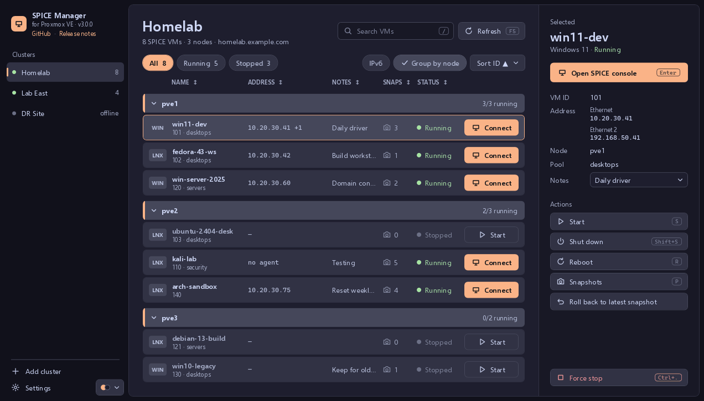
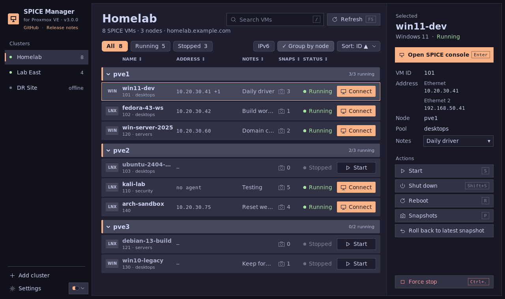
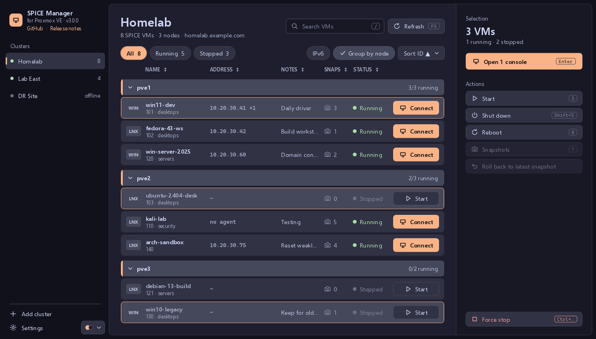
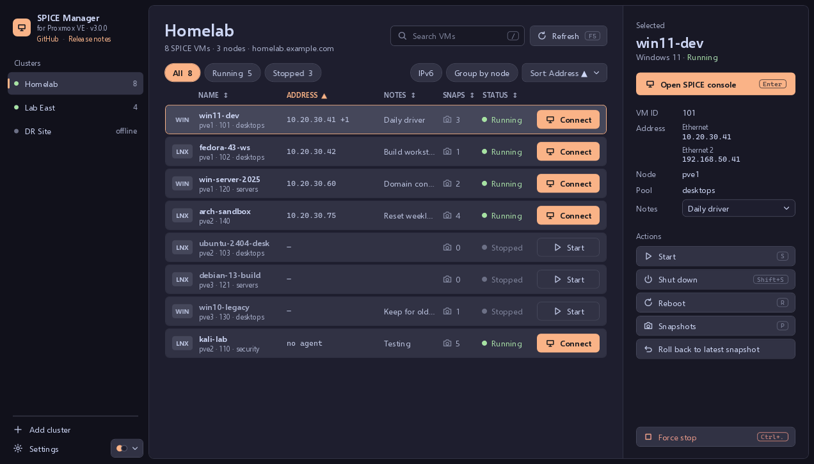
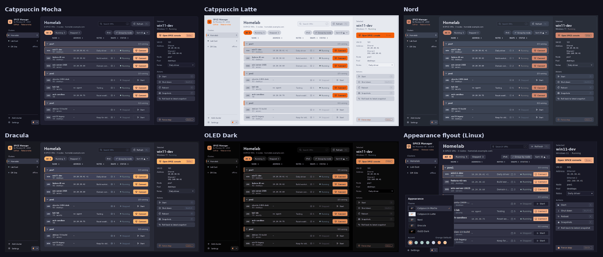
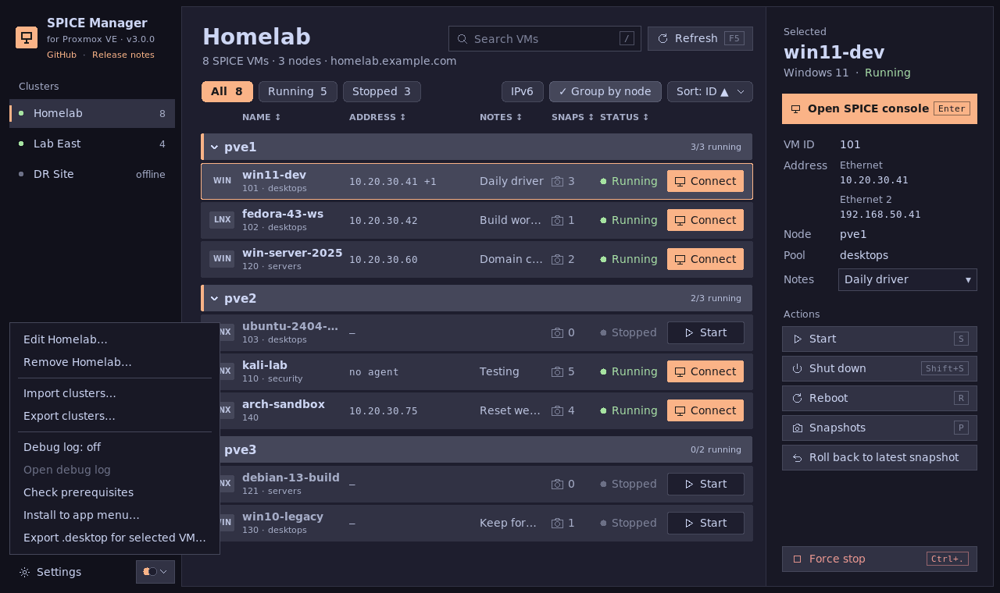

# Proxmox SPICE Connection Manager

Open SPICE consoles to your Proxmox VE virtual machines from a desktop app, without the browser.

Proxmox's default noVNC console runs in a browser tab. SPICE opens the VM in a native window instead: smoother for everyday desktop use, with a shared clipboard, a display that resizes with the window, sound, USB redirection and multiple monitors. It's meant for VMs running a desktop operating system; use SSH for headless servers. See [SPICE or noVNC?](proxmox-setup.md#spice-or-novnc)


**Current version: 3.0.0** · [GitHub](https://github.com/darthrater78/proxmoxspicemanager) · [Release notes](https://github.com/darthrater78/proxmoxspicemanager/releases/tag/v3.0.0) · [Changelog](CHANGELOG.md)



## Getting started

1. **Set up Proxmox:** a user and role, an API token or a username and password, and SPICE as your VMs' display → [proxmox-setup.md](proxmox-setup.md)
2. **Install the SPICE client** (`remote-viewer`, from virt-viewer):
   - Windows: the virt-viewer MSI from [spice-space.org](https://www.spice-space.org/download.html)
   - Fedora: `sudo dnf install python3-tkinter python3-keyring virt-viewer`
   - Debian/Ubuntu: `sudo apt install python3-tk python3-keyring virt-viewer`
3. **Download the app** from [Releases](../../releases/latest):
   - Windows: `Proxmox-SPICE-Manager.exe`, a single file with nothing else to install
   - Linux: `proxmox-spice-manager.py` → walkthrough in [linux-setup.md](linux-setup.md)

Both apps share one version, and every release carries both files.

## Features

- **Several clusters**, each logging in with an API token (stored securely) or a username and password (asked for, never saved)
- **Every SPICE-enabled VM** across a cluster's nodes, grouped by node or in one flat list; search, filter to running or stopped, and sort by any column
- **One-click consoles** from a VM's Connect button, a double-click or Enter
- **Guest addresses** per network adapter from the QEMU guest agent, with an IPv6 toggle
- **Power and snapshots:** start, shut down, reboot, force stop, and create, roll back or delete snapshots; select several VMs with Ctrl- or Shift-click to act on them together. The list refreshes as soon as Proxmox finishes the task
- **Keyboard shortcuts:** Enter opens the console, S starts, Shift+S shuts down, R reboots, P opens snapshots, Ctrl+. force stops, / searches, F5 refreshes
- **Notes** of your own per VM, alongside the VM's notes from Proxmox
- **Five themes and seven accent colours**
- **Import and export** of clusters, between machines and between the two apps
- **App menu entries:** the app itself (Linux `.desktop` file, Windows Start Menu), and on Linux one entry per VM that opens its console directly (`--connect "<cluster>" <vmid>`)

## Screenshots

The Linux app has the same layout:



Several VMs selected, with the actions panel acting on all of them:



One flat list, sorted by address:



The five themes, and the Appearance flyout next to Settings:



The Settings menu: clusters, import and export, the debug log, prerequisites and app menu entries:



Screenshots use mock clusters; [`tools/screenshots/`](tools/screenshots/README.md) renders them.

## Security

- **Token secrets** are kept in the OS keyring on Linux (GNOME Keyring, KDE Wallet, …), and encrypted with DPAPI on Windows, which only your Windows account can decrypt. Neither app writes a secret to its config file in plain text.
- **Passwords** are never saved. The app asks when it connects, keeps Proxmox's login ticket in memory, and renews it every hour.
- **Certificates:** one signed by a CA your system trusts just works. Proxmox's self-signed certificate is shown with its SHA-256 fingerprint the first time; compare it with Node → System → Certificates in Proxmox, confirm, and the app pins it for that cluster, like an SSH host key. A different certificate later brings up a warning before anything is sent. Plain `http://` hosts are refused.
- **Export files** contain secrets in plain text. Keep them safe and delete them once imported.

### Verifying a download

Releases are built by GitHub Actions from the tagged commit. Check a download against `SHA256SUMS`, or its build provenance with the [GitHub CLI](https://cli.github.com/):

```bash
sha256sum -c SHA256SUMS --ignore-missing
gh attestation verify Proxmox-SPICE-Manager.exe -R darthrater78/proxmoxspicemanager
gh attestation verify proxmox-spice-manager.py -R darthrater78/proxmoxspicemanager
```

## Configuration

| | Linux | Windows |
|---|---|---|
| Config | `~/.config/proxmox-spice/connections.json` | `%APPDATA%\proxmox-spice\connections.json` |
| Debug log (Settings → Debug log) | `~/.config/proxmox-spice/debug.log` | `%APPDATA%\proxmox-spice\debug.log` |

The config holds your clusters, theme, accent and VM notes. **Import** renames a cluster whose name is taken ("(Imported)") and stores its secret securely. A file exported from either app imports into the other. A Windows *config* file, as opposed to an export, holds DPAPI-encrypted secrets that only open for that Windows user; importing it elsewhere asks for those secrets again.

## Troubleshooting

| Problem | Solution |
|---|---|
| No VMs appear | Check the user has `VM.Audit` and the VMs' display is SPICE. Turn on the debug log (Settings) and look at the log file |
| Address shows "no agent" | The VM doesn't have the QEMU guest agent enabled in Proxmox (Options → QEMU Guest Agent) |
| Address shows "agent error" | The agent is enabled but not answering: install and start `qemu-guest-agent` inside the VM. Addresses also need the `VM.GuestAgent.Audit` permission |
| "Token secret not found" | Edit the cluster and enter the token secret again |
| Console opens black, or no shared clipboard | Install the guest tools inside the VM: `virtio-win-guest-tools.exe` from the VirtIO ISO on Windows, `spice-vdagent` on Linux (it needs a graphical session). See [proxmox-setup.md](proxmox-setup.md#change-the-display) |
| remote-viewer not found | Install virt-viewer (Getting started, step 2) and restart the app |

**Shut down** asks the guest OS to shut down (it must handle ACPI). **Force stop** ends the VM at once, like pulling the plug.

## Development

```bash
pip install -r requirements-dev.txt
bash scripts/check.sh    # version agreement, changelog entry, Python lint, shellcheck
bash scripts/build.sh    # Windows exe into dist/ (needs the .NET 8 SDK; works on Linux too)
```

- `windows/`: the Windows app (C#, WPF, .NET 8)
- `proxmox-spice-manager.py`: the Linux app, one standalone file (Python, tkinter)
- `scripts/`: the checks and build, used by CI and locally
- `tools/screenshots/`: renders both apps with mock data

Both apps are kept alike in look and behaviour. The version is declared in `windows/ProxmoxSpiceManager.csproj` and in `APP_VERSION` plus the docstring of `proxmox-spice-manager.py`, and `scripts/version.sh` fails if they disagree. To release, merge a version bump with its `CHANGELOG.md` entry, then push a `vX.Y.Z` tag on `main`. A `vX.Y.Z-dev.N` tag on a branch builds a pre-release.
