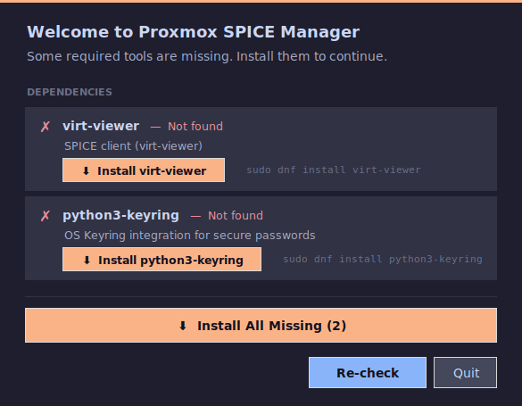
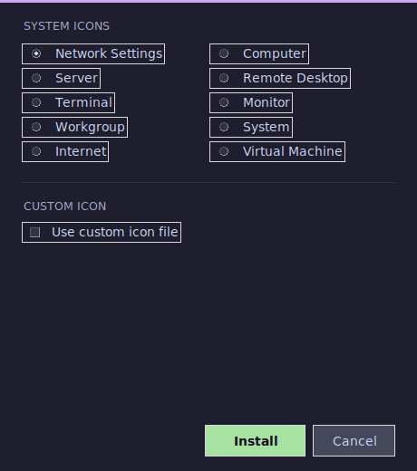
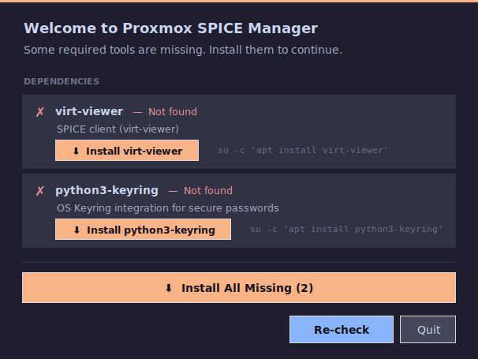

# Linux Setup

A walkthrough for installing and running Proxmox SPICE Manager on Fedora and Debian/Ubuntu. For Proxmox server configuration and first-run app setup, see [proxmox-setup.md](proxmox-setup.md).

---

## Getting Started

Download the script to a location of your choosing, then make it executable:

```bash
chmod +x proxmox-spice-manager.py
```

**FEDORA**

Run the script. A prerequisite check should appear on first launch.



Click to install anything that is missing. A password prompt will appear.


After the recheck completes, the window will close and the app should pop up. To "install" the app, open **Settings** (bottom left) and choose **Install to app menu…**. You can choose a bundled icon or use a custom one.




You can then search for it and pin it to your taskbar.


---

**DEBIAN**

Debian desktop doesn't include the user in sudoers by default so the logic changes a bit.

Running the script directly will provide this error:


The app will display the exact install command it needs — copy it, run it in your terminal, then run the script again.

You'll then get the setup install screen for whatever else may be missing.



---

Once the app is running, continue with [proxmox-setup.md](proxmox-setup.md) to configure your Proxmox connection.
