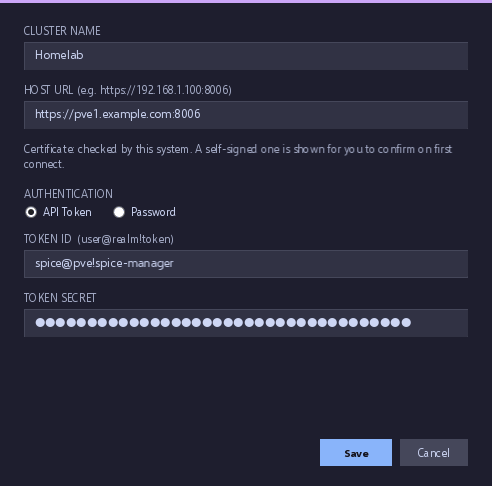
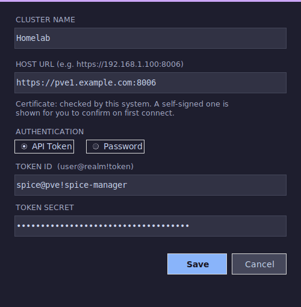
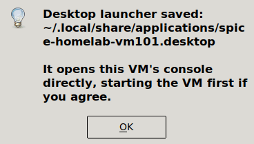

# Proxmox & App Setup

This guide covers configuring Proxmox VE and connecting it to the SPICE Manager app. These steps apply to both Linux and Windows.

---

## Proxmox Setup

You can use an existing user/password or a user/API token. API tokens are recommended.

### User

From the Datacenter section, go to **Users** and create a new user. Use the **Proxmox VE** auth type and set a secure password.

### Role

Create a minimal role with only the permissions needed. Select `VM.PowerMgmt` `VM.Audit` `VM.Snapshot.Rollback` `VM.Console` `Pool.Audit` `VM.Snapshot` `VM.GuestAgent.Audit`

> **Note:** `VM.GuestAgent.Audit` is optional — it enables the live IP address column. Without it, the IP column will be blank but everything else works normally.

### API Token

Create a token and keep **Privilege Separation** checked. Make note of the API key — this is the only time you will see it.

### Permissions

You will need two permission entries: one for the user and one for the API token. Choose the role you created for both. Privilege Separation makes this necessary and is a safety feature.

### VM Display Configuration

> **SPICE is for graphical (GUI) operating systems only.** Headless or CLI-only VMs won't benefit from a SPICE console — use SSH for those instead.

For a VM to appear in the app, set its display to **SPICE (qxl)** under Hardware → Display in the Proxmox web UI.

SPICE sessions will open but won't function correctly without guest drivers installed inside the VM:

- **Windows guests** — install the [VirtIO drivers](https://fedorapeople.org/groups/virt/virtio-win/direct-downloads/stable-virtio/virtio-win.iso) (`virtio-win-guest-tools.exe`) and [SPICE guest tools](https://www.spice-space.org/download.html)
- **Linux guests** — install `spice-vdagent` (`sudo dnf install spice-vdagent` or `sudo apt install spice-vdagent`)

---

## App Setup

Open the SPICE Manager and choose **Add cluster** from the lower left.

Enter the name, any of the hosts in the cluster, and the token ID and secret. Take note of the format of the token ID: `user@realm!tokenname`.

| Windows | Linux |
|---|---|
|  |  |

Choose the cluster and hit **Refresh**. Any VM with the display set to SPICE will show up here.

You can launch console sessions directly from the app, or on Linux you can export individual VM sessions as desktop shortcuts to launch them without opening the app. Select the VM, open **Settings**, and choose **Export .desktop for selected VM…**:

