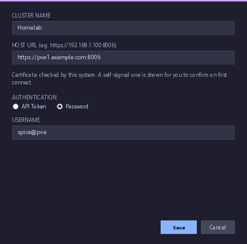
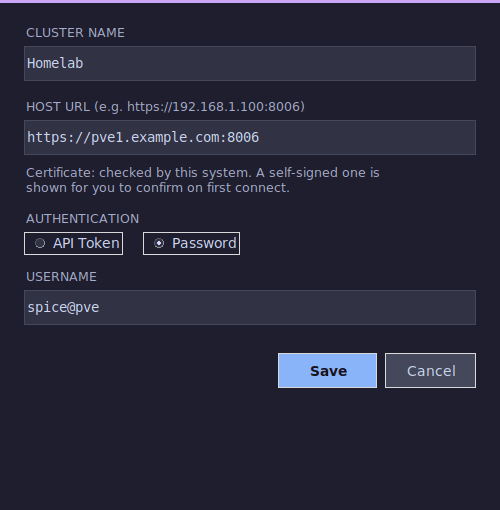
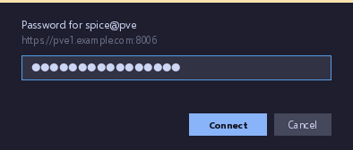
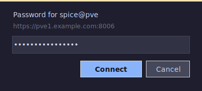

# Proxmox & App Setup

This guide covers configuring Proxmox VE and connecting it to the SPICE Manager app. These steps apply to both Linux and Windows.

---

## Proxmox Setup

The app can log in to Proxmox in two ways:

| | API token (recommended) | Username and password |
|---|---|---|
| What you enter in the app | Token ID and secret | Username; the password is asked for when you connect |
| What is saved | The secret, in the OS keyring (Linux) or DPAPI-encrypted (Windows) | Nothing: the password is never saved |
| Access | Limited to the token's own permissions, and can be revoked on its own | Everything the user can do |

Both need a user and a role. Then follow either **Option A** or **Option B**.

### User

From the Datacenter section, go to **Users** and create a new user. Use the **Proxmox VE** auth type (realm `pve`) and set a secure password. You can also use an existing user, including a Linux user on the node (realm `pam`, such as `root@pam`), though a dedicated user with only the permissions below is safer.

### Role

Create a minimal role with only the permissions needed. Select `VM.PowerMgmt` `VM.Audit` `VM.Snapshot.Rollback` `VM.Console` `Pool.Audit` `VM.Snapshot` `VM.GuestAgent.Audit`

> **Note:** `VM.GuestAgent.Audit` is optional — it enables the live IP address column. Without it, the IP column will be blank but everything else works normally.

### Option A: API token

**Token.** Select the user, go to **API Tokens**, and create a token. Keep **Privilege Separation** checked. Make note of the token secret — this is the only time you will see it.

**Permissions.** Under **Permissions**, you will need two entries: one for the user and one for the API token. Choose the role you created for both. Privilege Separation makes this necessary and is a safety feature: the token can do only what both entries allow.

### Option B: Username and password

**Permissions.** Under **Permissions**, add one entry for the user with the role you created. There is no token, so the second entry isn't needed.

In the app you enter the username with its realm, such as `spice@pve` or `root@pam`, and no password (see [App Setup](#app-setup) below). The app asks for the password the first time it connects to that cluster, and again after you restart the app. It keeps the login ticket Proxmox gives back in memory and renews it every hour, so you aren't asked again while the app is open. A VM launcher exported to the app menu (Linux) asks each time it starts.

---

## Install the SPICE Client

The app opens each console in `remote-viewer`, which comes with **virt-viewer**. Install it on the computer you run the app on (not inside the VMs):

- **Windows** — go to [spice-space.org/download.html](https://www.spice-space.org/download.html), download the virt-viewer **Windows installer** (the x64 MSI), and run it. Restart the app afterwards so it finds `remote-viewer`.
- **Linux** — install the `virt-viewer` package (`sudo dnf install virt-viewer` or `sudo apt install virt-viewer`). The app's first-run prerequisite check offers to install it for you; see [linux-setup.md](linux-setup.md).

---

## Switch a VM's Display to SPICE

### SPICE or noVNC?

Proxmox's default console is **noVNC**: it opens in a browser tab from the web UI, works with any display type, and needs nothing installed. It's fine for installing an OS or a quick look, but it's slow for everyday desktop use and has no shared clipboard.

**SPICE** opens the VM in a native window (`remote-viewer`) instead. It's smoother for day-to-day desktop work, and with the guest tools installed it adds copy and paste between your computer and the VM, a display that resizes with the window, sound, USB redirection, and multiple monitors. It needs the VM's display set to SPICE, the SPICE client on your computer, and the guest tools in the VM. The noVNC console in Proxmox still works after you switch, if you ever need it.

> **Use SPICE only for VMs running a desktop operating system** (Windows, or Linux with a graphical desktop). Headless servers and command-line-only VMs gain nothing from it: leave their display as it is and use SSH, or the Proxmox console, for those.

### Change the display

The app lists only VMs whose display is set to SPICE. In the Proxmox web UI, for each desktop VM:

1. Select the VM and open **Hardware**.
2. Double-click **Display** (or select it and click **Edit**).
3. Set **Graphic card** to **SPICE**. The SPICE multi-monitor options (dual, 3 or 4 monitors) work too. Click **OK**.
4. Restart the VM so the change applies: shut it down and start it, or use **Reboot** in Proxmox or in the app. A restart from inside the guest keeps the old display. Until then Proxmox shows the change in orange as pending.

SPICE sessions will open but won't work correctly without guest drivers installed inside the VM:

- **Windows guests** — install the [VirtIO drivers](https://fedorapeople.org/groups/virt/virtio-win/direct-downloads/stable-virtio/virtio-win.iso) (`virtio-win-guest-tools.exe`) and [SPICE guest tools](https://www.spice-space.org/download.html)
- **Linux guests** — install `spice-vdagent` (`sudo dnf install spice-vdagent` or `sudo apt install spice-vdagent`)

**Optional: the IP address column.** To see a VM's IP address in the app, turn on the QEMU guest agent: under the VM's **Options**, edit **QEMU Guest Agent** and check **Use QEMU Guest Agent**, then install the agent inside the guest (`qemu-guest-agent` on Linux; on Windows it comes with `virtio-win-guest-tools.exe`) and restart the VM.

---

## App Setup

Open the SPICE Manager and choose **Add cluster** from the lower left.

Enter the name, any of the hosts in the cluster, and how to log in.

**With an API token (Option A):** leave **API Token** selected and enter the token ID and secret. Take note of the format of the token ID: `user@realm!tokenname`.

| Windows | Linux |
|---|---|
|  |  |

**With a username and password (Option B):** select **Password** and enter the username with its realm. There is no password field: the app asks for the password when it connects, and doesn't save it.

| Windows | Linux |
|---|---|
|  |  |

When the app first connects to the cluster, it asks for the password:

| Windows | Linux |
|---|---|
|  |  |

Choose the cluster and hit **Refresh**. Any VM with the display set to SPICE will show up here.

You can launch console sessions directly from the app, or on Linux you can export individual VM sessions as desktop shortcuts to launch them without opening the app. Select the VM, open **Settings**, and choose **Export .desktop for selected VM…**:

